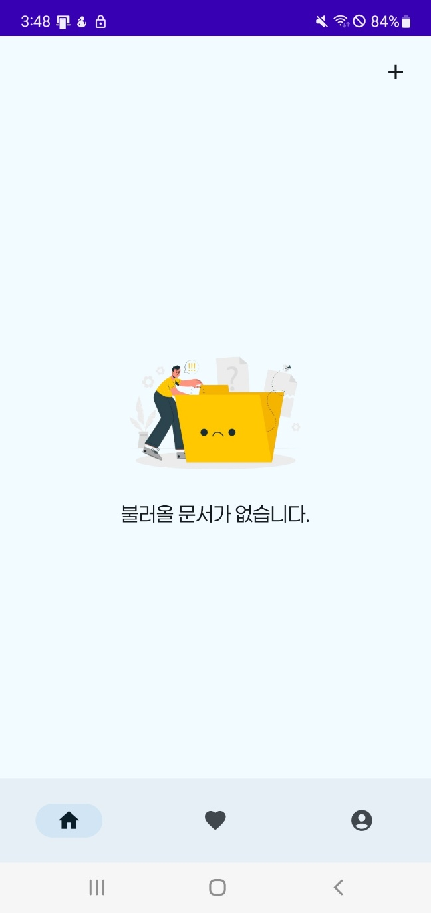
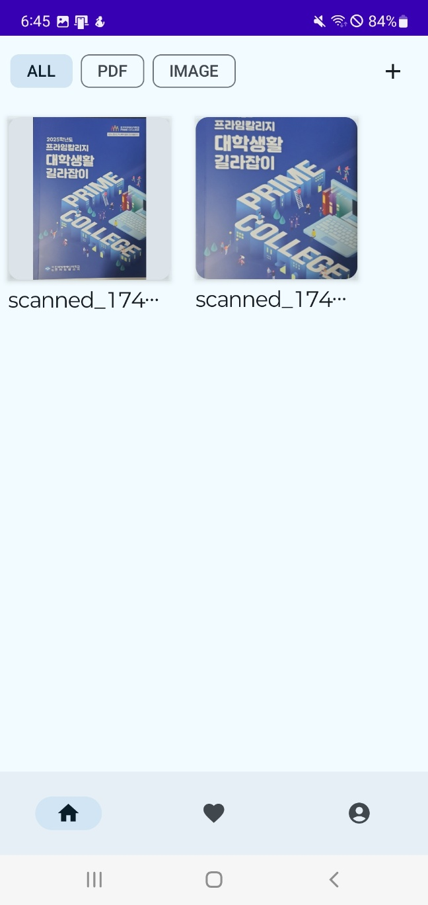
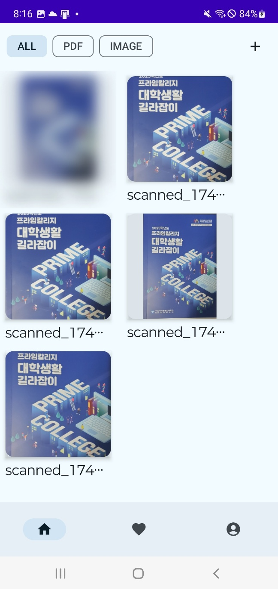
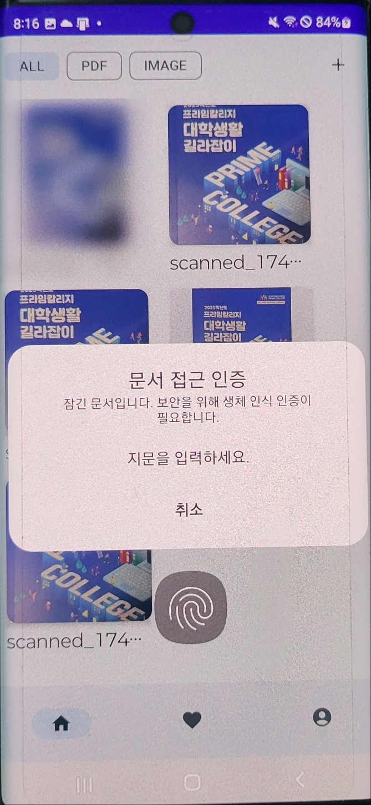
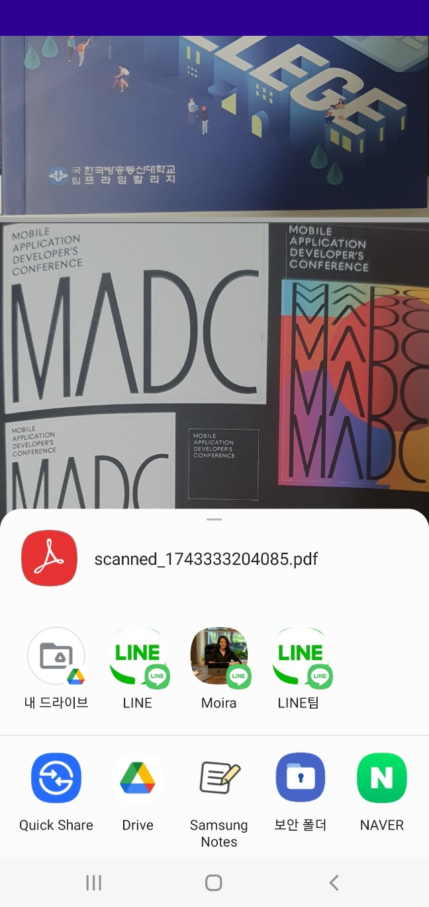
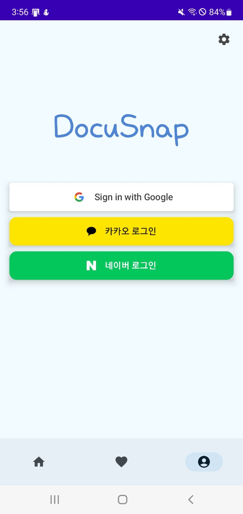
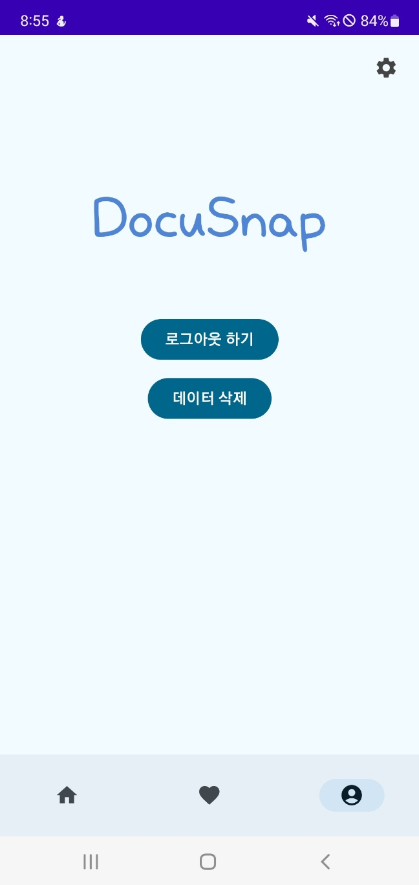
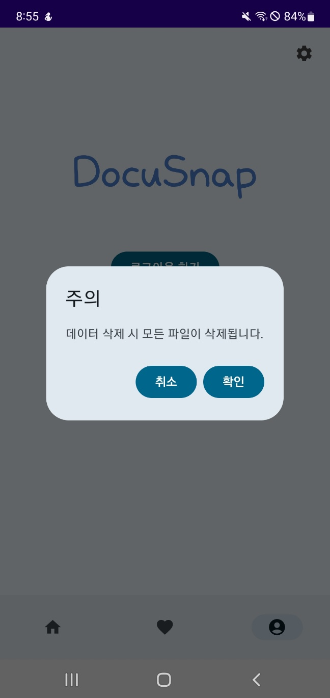

# DocuSnapApp

**DocuSnap 앱**은 언제 어디서든 간편하게 문서를 스캔하고 파일로 저장하여 쉽게 관리하고 공유할 수 있는 앱입니다.

---

### 주요 기능

- **문서 스캔**
    - Google ML Kit를 활용하여 지정된 범위 내에서 문서를 스캔합니다. (최대 10페이지 지원)
    - 스캔 결과를 PDF와 JPG 파일로 저장할 수 있습니다.
- **즐겨찾기 기능**
    - 사용자가 즐겨찾기로 표시한 문서를 따로 관리할 수 있습니다.
- **문서 공유**
    - 저장된 문서 파일을 타 앱으로 손쉽게 공유할 수 있습니다.
- **보안 강화**
    - 민감한 문서에 대한 접근을 제한하기 위해 지문 인식을 통한 잠금 기능을 제공합니다.
- **소셜 로그인 지원**
    - 구글, 카카오, 네이버 등 다양한 소셜 플랫폼을 통한 간편 로그인 기능을 지원합니다.

---

## 적용 기술 및 아키텍처

### 클린 아키텍처

DocuSnap 앱은 계층별 책임 분리를 통해 유지보수와 확장성을 고려하여 다음과 같이 구성되어 있습니다

- **App 모듈** (DI 설정)
    - ***App 클래스*** : 앱의 Application 클래스로, 카카오 및 네이버 로그인 초기화 등 전역 설정을 담당합니다.
    - ***AppModule*** : Hilt를 활용하여 Application ID, GoogleSignInClient 등 앱 전반에 필요한 의존성을 주입합니다.
    - ***DatabaseModule*** : 데이터베이스와 DAO 객체를 생성하여 주입합니다.
    - ***DataModule*** : Domain 계층의 Repository 인터페이스 구현체를 제공하여 데이터 작업을 추상화합니다.
- **Data 모듈** (데이터 저장 및 외부 라이브러리 연동)
    - ***ApplicationDatabase*** : Room을 사용한 데이터베이스 설정을 관리합니다.
    - ***DAO 및 Entity***: 데이터베이스 쿼리와 테이블 객체를 정의하며, Room의 타입 컨버터 등을 활용해 데이터 변환을 처리합니다.
    - ***RepositoryImpl*** : Domain 모듈의 Repository 인터페이스 구현체로, DAO 쿼리 결과를 가공하여 반환
- **Domain 모듈** (비즈니스 로직)
    - ***Model*** : Data 모듈의 Entity를 기반으로 한 도메인 모델을 정의합니다.
    - ***Repository 인터페이스*** : 데이터 계층의 DB 기능을 추상화합니다.
    - ***UseCase*** : 앱의 핵심 기능(문서 스캔, 즐겨찾기 처리, PDF 썸네일 추출 등)을 처리하는 비즈니스 로직을 구현합니다.
- **Presentation 모듈** (UI 및 상태 관리)
    - ***UI (Compose)*** : 하나의 Activity와 여러 Compose 화면으로 구성되어 있으며, 모든 화면은 최신 Compose 기술을 사용해 구현하였습니다.
    - ***ViewModel*** : UseCase와 UI 사이의 중간 계층으로, Flow와 State를 활용해 데이터의 변화를 구독하고 UI에 반영합니다.

## Compose

- 모든 UI는 Compose로 작성되며, 단일 Activity 기반에서 화면 전환과 상태 관리를 수행합니다.
- 데이터베이스의 Flow를 구독하여 실시간으로 최신 데이터를 반영합니다.

## Material 3

- 최신 머터리얼 디자인 가이드라인에 따라 Material 3를 사용하여 사용자에게 일관되고 현대적인 UI 경험을 제공합니다.

### Hilt

- Hilt를 사용하여 의존성을 주입함으로써 모듈 간 결합도를 낮추고, 테스트 용이성과 코드 재사용성을 높였습니다.

---

## 사용 라이브러리

- Hilt : 의존성 주입
- Navigation : Compose 화면 전환
- Gson : 화면 전환 시 모델 객체 직렬화
- Room : 데이터베이스 활용
- Coil : 이미지 로딩
- ML Kit (document-scanner) : 문서 스캔
- PDF Viewer : PDF 문서 렌더링 및 뷰어 기능
- Biometric : 지문 인식
- Firebase (Google SignIn) : 구글 로그인
- Kakao : 카카오 로그인 시
- Naver : 네이버 로그인

---

### 주요 화면

    
    
    
    

1. **홈 화면**
- 데이터 출력
    - 저장된 문서 목록을 LazyVerticalGrid로 표시합니다.
    - 데이터가 없으면 “불러올 문서가 없습니다.”라는 메시지가 표시됩니다.
    - 스캔한 PDF 문서는 첫 페이지를 썸네일로 표시합니다.
- 필터 기능
    - 데이터가 있는 경우에만 나타납니다.
    - FilterChip 컴포저블을 사용하여 전체, PDF 문서만, 이미지 문서만 따로 선택 가능합니다.
- 스캔 기능
    - 우측 상단에 “+” 버튼을 누르면 ML Kit를 활용한 스캔이 가능합니다.
    - 스캔 후 결과는 내부 저장소에 파일화되고 DB에 저장되어 실시간으로 목록에 갱신됩니다.
- 잠금 기능
    - 잠긴 문서나 이미지를 선택 시 지문 인식을 통해 내용 확인이 가능합니다.

---

    
    
    
    

1. **상세 화면**
- 화면 구성
    - 전체 화면에 PDF, 이미지를 출력하고 PDF의 경우 스크롤이 가능합니다.
    - 하단에는 액션바가 나타나며 즐겨찾기, 공유, 잠금 기능을 제공합니다.
- 뷰어 기능
    - PDF : 별도의 PDF 뷰어 라이브러리를 사용하여 내용 출력 및 확대/축소 기능을 제공합니다.
    - Image : Coil 라이브러리로 내부저장소의 이미지를 로드하고 확대/축소 기능은 기본으로 제공되지 않기 때문에 별도 코드로 구현하였습니다.
- 즐겨찾기 기능
    - 모아서 관리할 문서나 이미지인 경우 즐겨찾기에 추가가 가능합니다.
    - 추가/제거 시 즐겨찾기 테이블에서 해당 데이터를 처리합니다.
- 공유 기능
    - PDF, 이미지 각각 공유 가능한 앱이 다르기 때문에 별도의 Intent Type을 적용하였습니다.
    - 원하는 공유 방법 선택 시 공유가 가능합니다.
- 잠금 기능
    - 잠금 시 : 지문 인증을 사용하며 지문이 일치한 경우에만 잠금이 가능합니다.
    - 해제 시 : 별도의 인증이 필요 없습니다.
    - 잠금/해제 시 스캔 문서 테이블의 값을 갱신합니다.

---

    
    
    

1. **마이페이지 화면**
- 화면 구성
    - DB에서 유저 정보를 가져와 화면에 표시합니다.
- 로그인
    - 유저 정보가 없는 경우 구글(Firebase Auth), 카카오, 네이버 로그인을 지원합니다.
    - 로그인 후 유저 정보를 DB에 저장합니다.
- 로그아웃
    - 로그아웃 버튼 클릭 시 로그인 유저 정보를 DB에서 삭제합니다.
- 데이터 삭제
    - 로그인 된 상태에서 데이터 삭제 버튼 클릭 시 내부저장소에 저장된 파일과 관련된 DB 데이터를 모두 삭제합니다.
